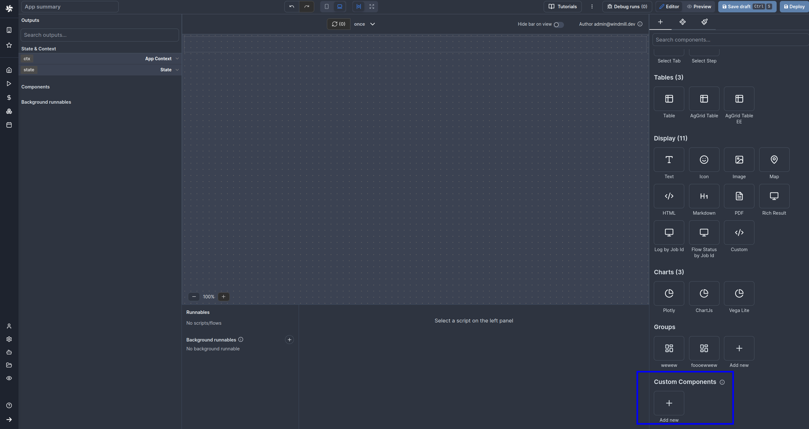
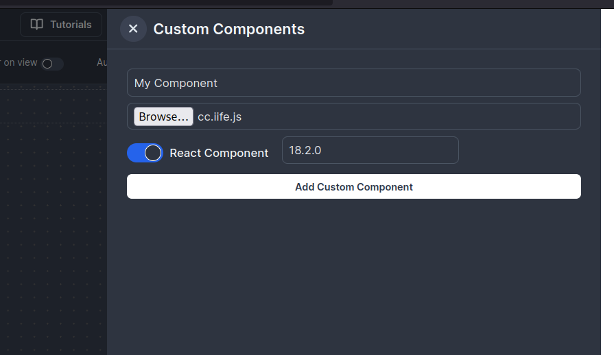

# Windmill Custom Component Template in React

Template for creating a custom component for [Windmill](https://windmill.dev)
using React

## Getting Started

1. Clone the project
2. Install the dependencies

```bash
npm install
```

3. Start the development server

```bash
npm run dev
```

4. Open your browser to see the live result.

5. Start editing the `src/Component.tsx` file to start building your component.

6. Edit COMPONENT_NAME in `vite.config.ts` to match your component name. It will
   be useful later

7. Build the iife using `npm run build`

8. Upload the `dist/cc.iife.js` to windmill




